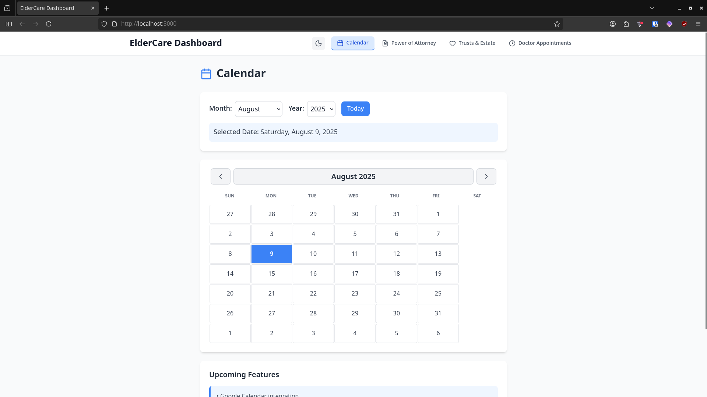
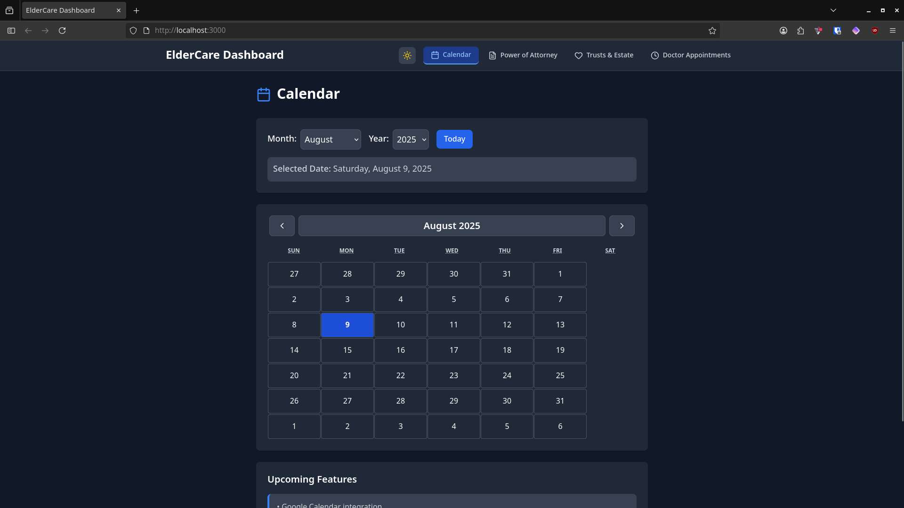
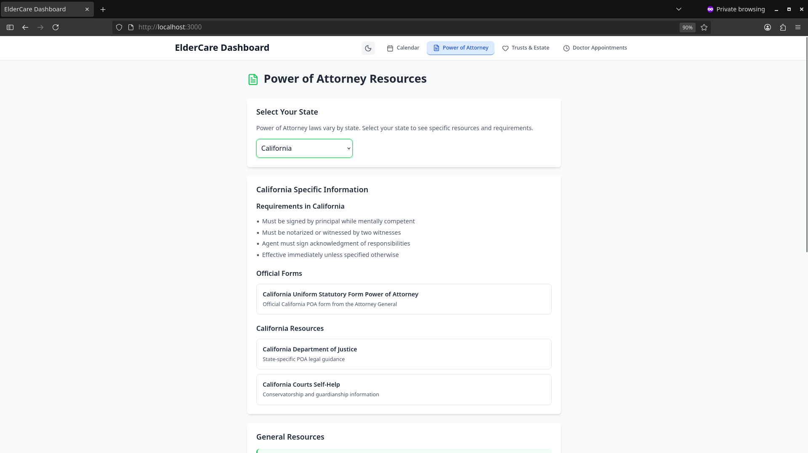
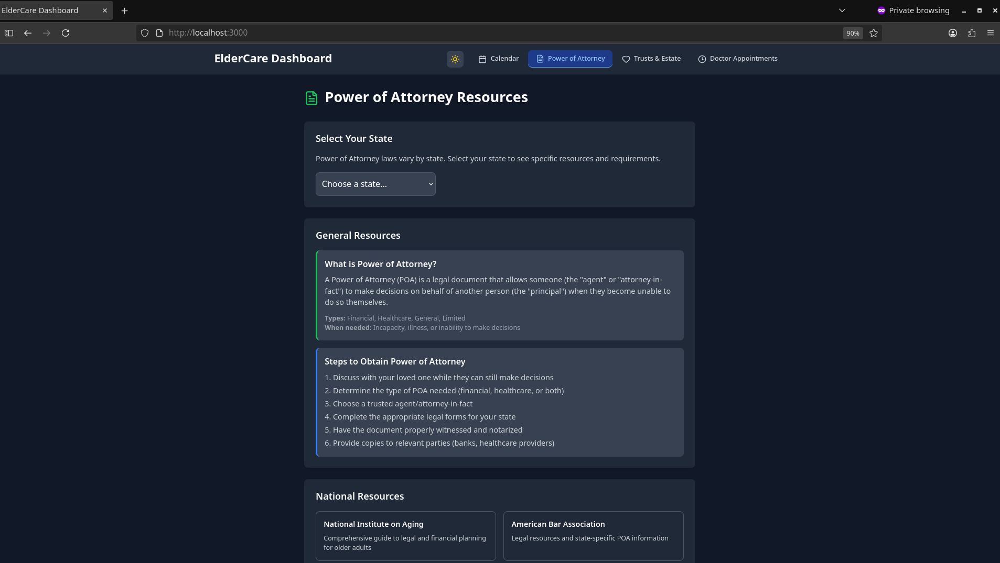

# ElderCare

## Calender Preview:

## Data Preview:

##### Todo:

Make the Calender work with doctor appointments and medicine scheduler tabs.
Create API to allow things marked on the ElderCare Calender to sync to Google Calender.

Accounts:

 * Create account feature with password and Google federated sign in.
 * Add elderly as "profile groups" to assign things to the calender
 * Allow changing of each elderly that reflects on the ElderCare Calender
 * Make differente medicine profiles for each elderly.
